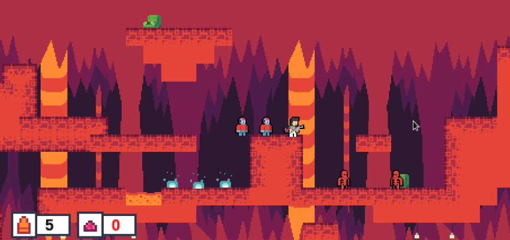

# DTF GameJam

Ссылка на игру:

https://azbang.github.io/dtf-gamejam/www/index.html

# Концепция

Кор. механика игры -- собирать органы и создавать подданных, которые необходимы для прохождения различных локаций.
Реиграбельность заключается в перепрохождении локаций с новым числом зомби, что поволяет исследовать новые непроходимые до этого места. В перспективе наличие дополнительных миров, крафт из органов различных видов подданых, что позволит проходить старые препятствия, которые при первом прохождении пройти не удалось.
